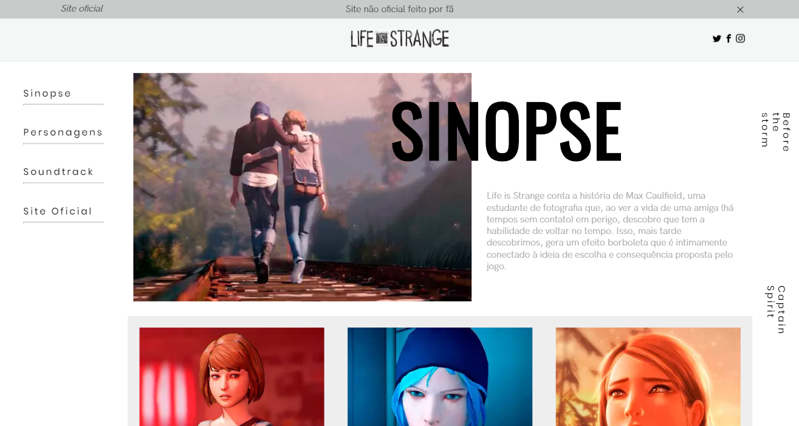

# Life is Strange Unofficial Website
> An unofficial Life is Strange website made by a fan of the game.



## About

This project was made only for educational purposes, any suggestion of improvement is welcome. Then, feel free to submit your PR or publish an Issue.

## License

This project is licensed under the MIT License - see the [LICENSE.md](LICENSE.md) file for details.

## Contributing

1. Fork it (https://github.com/doougui/life-is-strange-fan-made/fork)
2. Clone repository (```git clone https://github.com/yourname/life-is-strange-fan-made```)
3. Create your feature branch (```git checkout -b your_feature_name```)
4. Commit your changes (```git commit -am 'Add some changes'```)
5. Push it to the branch (```git push origin your_feature_name```)
5. Create a new Pull Request